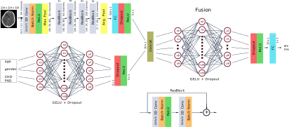
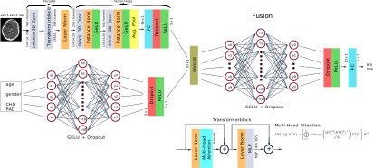

# Model Architectures

This folder contains the visual representations of two key architectures used in our project:

- **ResNetMLP:** A hybrid model combining Residual Networks (ResNet) with two Multi-Layer Perceptrons (MLP).
- **ViTMLP:** A Vision Transformer (ViT) based architecture integrated with two MLP layers.

---

## Architectures

  

    
<strong>Architecture ResNetMLP</strong>

    
  

  

    
<strong>Architecture ViTMLP</strong>

    
  

---

## Code

You can use the provided model implementations to process your own tasks:

- [`MultiResNetMLPRegression.py`](./MultiResNetMLPRegression.py)
- [`MultiViTMLPRegression.py`](./MultiViTMLPRegression.py)

These scripts define the **ResNetMLP** and **ViTMLP** architectures respectively and can be easily integrated into your custom pipelines for training or inference.

> ⚠️ **Note:**
> The code for fine-tuning is not publicly available due to legal restrictions.
> However, you can seamlessly incorporate the provided models into your own code and datasets.

---

Feel free to explore these architecture diagrams and model definitions to understand the designs and integrate them into your workflow.

